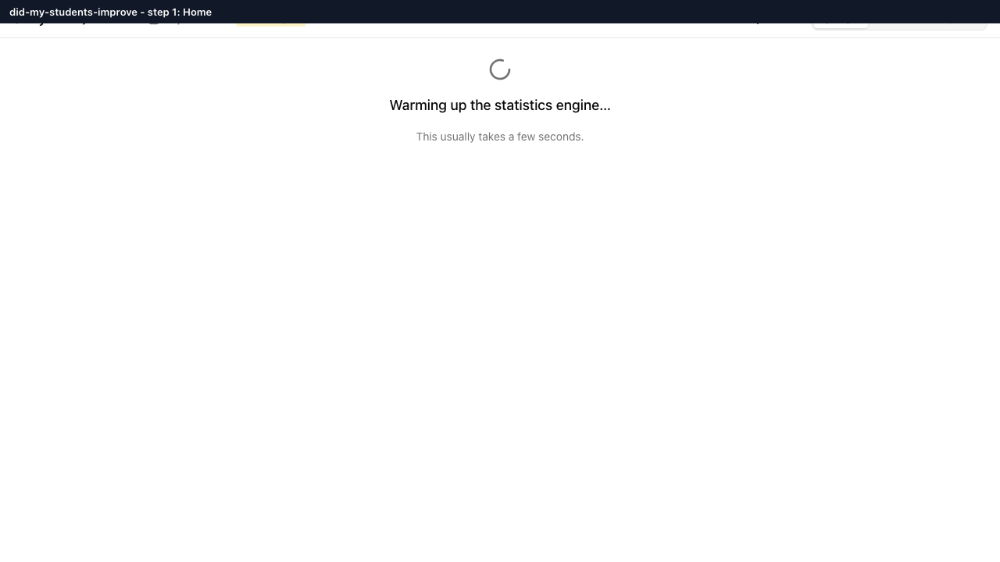

# Installing Statly (SPEC §14)

Statly is a free desktop app for planning and running statistics for
classroom studies. This is a one-page guide to installing it on macOS or
Windows. Builds are unsigned for now, so both operating systems show a
warning the first time you open the app. That warning is normal; the steps
below get you past it.



## Where to download

- **From the project owner:** builds are attached to each GitHub Actions
  run. Go to the repository's **Actions** tab, open the most recent
  successful **build** workflow run, and download the artifact for your
  platform from the **Artifacts** section at the bottom of the run's
  Summary page:
  - `statly-aarch64-apple-darwin.dmg` (Apple Silicon Mac: M1/M2/M3/M4)
  - `statly-x86_64-apple-darwin.dmg` (Intel Mac)
  - `statly-x86_64-pc-windows-msvc-setup` (Windows 10/11)
- **From GitHub Releases:** the same three files are attached to each
  numbered release on the repository's
  [Releases page](https://github.com/Multifidus/statly/releases), so people
  don't need a GitHub account or Actions access to download.

## Sharing the installer

Many email systems block `.exe` attachments outright, and both installers
are large. If you're sharing a build with a colleague or class:

- Upload it to Google Drive (or another shared drive) and send the link, or
- Copy it onto a flash drive.

## Installing

**macOS:** open the downloaded `.dmg`, then drag `Statly.app` into your
`Applications` folder.

**Windows:** run the downloaded `*-setup.exe` installer and accept the
defaults.

## First launch: getting past the security warning

Because Statly isn't code-signed yet, macOS and Windows both flag it as
coming from an "unidentified" or "unverified" source the first time you
open it. This is expected. Here's how to get past it on each platform.

### macOS 15+ (Sequoia and later)

1. Open `Statly.app` from `Applications` (double-click it) once.
2. macOS will refuse to open it and say it "cannot be opened because the
   developer cannot be verified" (Control-click → Open no longer bypasses
   Gatekeeper on recent macOS, so don't rely on that).
3. Go to **System Settings → Privacy & Security**.
4. Scroll down to the **Security** section. You'll see a message that
   Statly was blocked, with an **Open Anyway** button next to it. Click it.
5. Confirm in the dialog that appears (you may need to enter your Mac
   password or use Touch ID).
6. Statly now opens normally, and every future launch works without this
   detour.

**If macOS says the app is "damaged" instead:** this can happen when the
quarantine flag survives being copied around (email, some cloud sync
tools). Open **Terminal** and run:

```bash
xattr -dr com.apple.quarantine /Applications/Statly.app
```

Then relaunch Statly from Applications; it should open normally.

### Windows 10/11 (SmartScreen)

1. Run the installer or launch `Statly.exe`.
2. Windows shows a blue **"Windows protected your PC"** SmartScreen
   screen.
3. Click **More info**.
4. A **Run anyway** button appears. Click it.
5. Statly installs/launches normally. This warning typically only appears
   on first run.

## Confirming it's working

Once Statly opens, wait for the "engine ready" card, which shows both the
app version and the statistics engine version. If you don't see it within
a few seconds, see `docs/TESTING_INSTALLS.md` for a fuller install-testing
checklist (useful if you're verifying a build rather than just using the
app).

## Later: proper code signing

An unsigned build means these warnings will always show up on a clean
machine. SPEC §14 notes an optional later upgrade: Apple Developer ID
signing and notarization for macOS, and a Windows code-signing
certificate, both wired into CI via secrets once the project owner
decides to invest in them. Until then, the steps above are the expected
(safe) way to open Statly.
